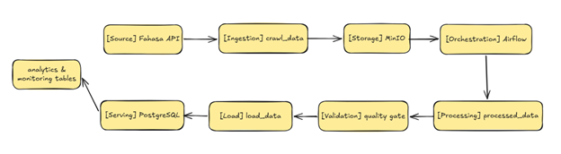

# Data Pipeline Fahasa

This project implements an end-to-end data pipeline for e-commerce data:

crawl (local) → upload to MinIO → trigger Airflow → process → validate → load → audit

The system includes data quality validation, pipeline monitoring, and incremental snapshot to avoid redundant data storage.

## Pipeline Architecture

1. Crawl data locally from Fahasa API
2. Upload raw data to MinIO
3. Trigger Airflow DAG
4. Process and validate data
5. Apply quality gate
6. Load into PostgreSQL
7. Track pipeline execution (audit & status)

Each pipeline run is tracked using:
- pipeline_runs
- pipeline_task_audit
- data_quality_reports
- rejected_products

## Features

- Data quality validation (field-level checks)
- Quality gate to stop bad data
- Pipeline audit tracking
- Failure handling (fail fast)
- Incremental snapshot (only store changed data)
- Dockerized environment
- Airflow orchestration

## Run the project

1. Start services:
    ```bash
   docker-compose up -d
2. Initialize database:
   ```bash
   python init_schema.py
4. Run pipeline:
   ```bash
   python start_pipeline.py
   
> Note: PostgreSQL runs inside Docker, so services must be started before initializing schema.
   
## Project Structure

- start_pipeline.py       # Entry point (crawl + trigger DAG)
- call_trigger_dag.py     # Trigger Airflow DAG
- crawl_data_toi_uu.py    # Data extraction
- processed_data.py       # Data cleaning & validation
- load_data.py            # Load to PostgreSQL
- audit_utils.py          # Pipeline tracking
- init_schema.py          # Database schema
- dags/                   # Airflow DAGs

     

## Expected Result

- Raw data stored in MinIO
- Clean data loaded into PostgreSQL
- product_snapshot only updates when data changes
- Pipeline execution tracked in audit tables

## Future Improvements

- Add automated testing -> prepare
- Improve incremental logic with hashing -> prepare
- Build dashboard (Metabase) -> doing
- Add alerting (email/telegram) -> done

   
